# Frontend Mentor - Space tourism website solution

This is a solution to the [Space tourism website challenge on Frontend Mentor](https://www.frontendmentor.io/challenges/space-tourism-multipage-website-gRWj1URZ3). Frontend Mentor challenges help you improve your coding skills by building realistic projects. 

## Table of contents

- [Overview](#overview)
  - [The challenge](#the-challenge)
  - [Screenshot](#screenshot)
  - [Links](#links)
- [My process](#my-process)
  - [Built with](#built-with)
  - [What I learned](#what-i-learned)
  - [Continued development](#continued-development)
  - [Useful resources](#useful-resources)
- [Author](#author)

## Overview

### The challenge

Users should be able to:

- View the optimal layout for each of the website's pages depending on their device's screen size
- See hover states for all interactive elements on the page
- View each page and be able to toggle between the tabs to see new information

### Screenshot

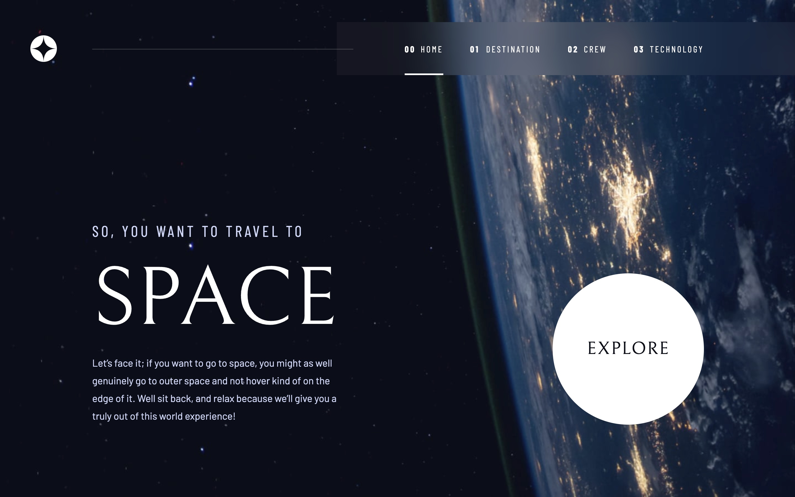
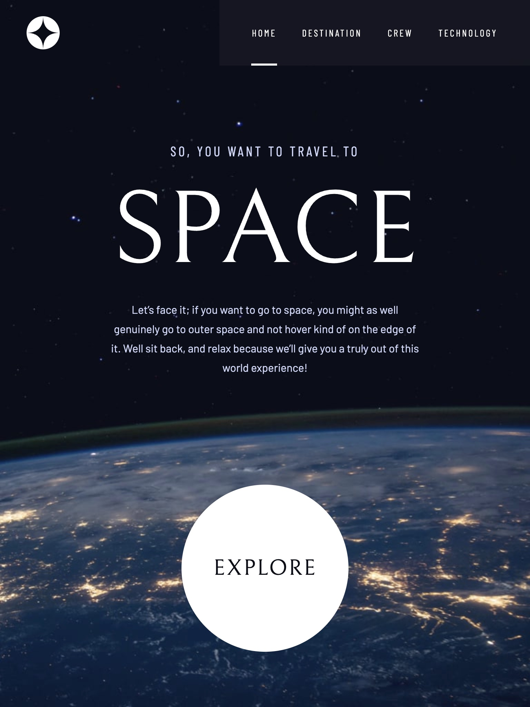
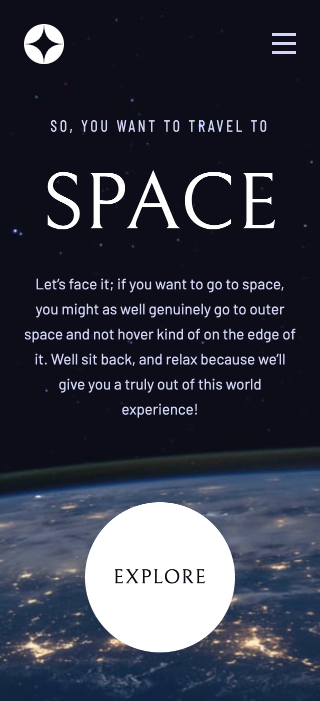
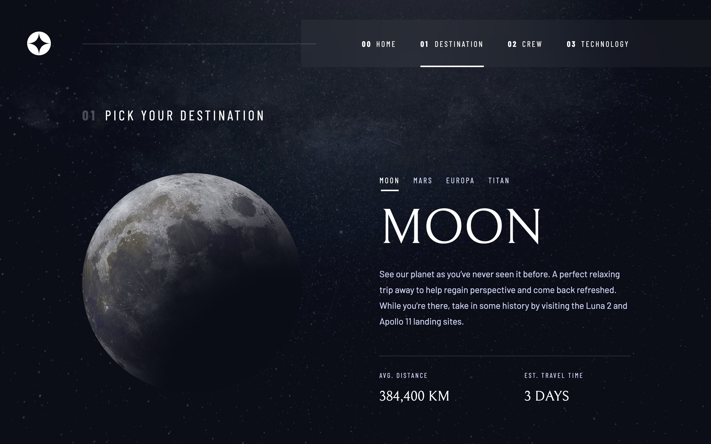
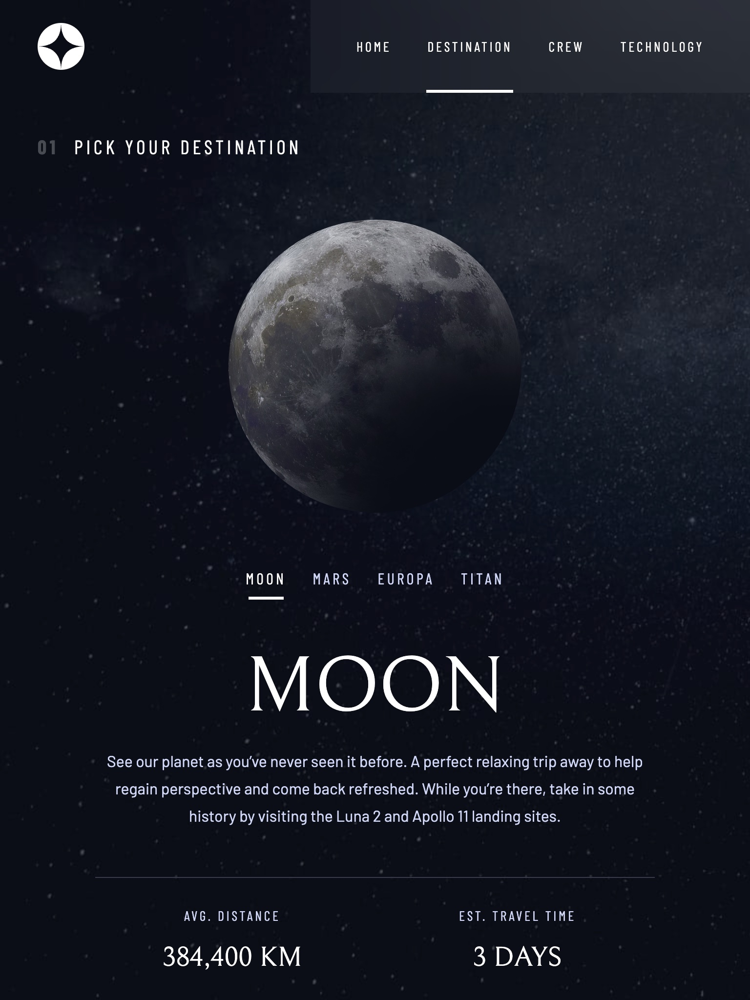
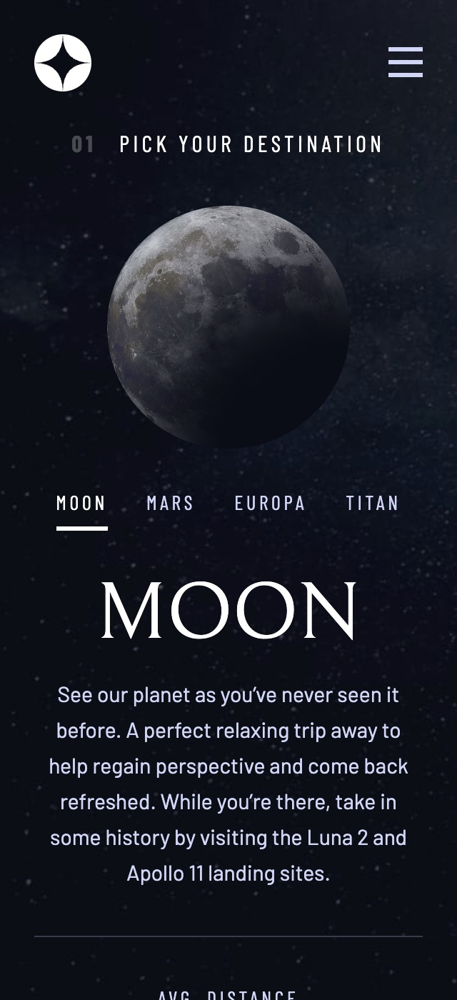
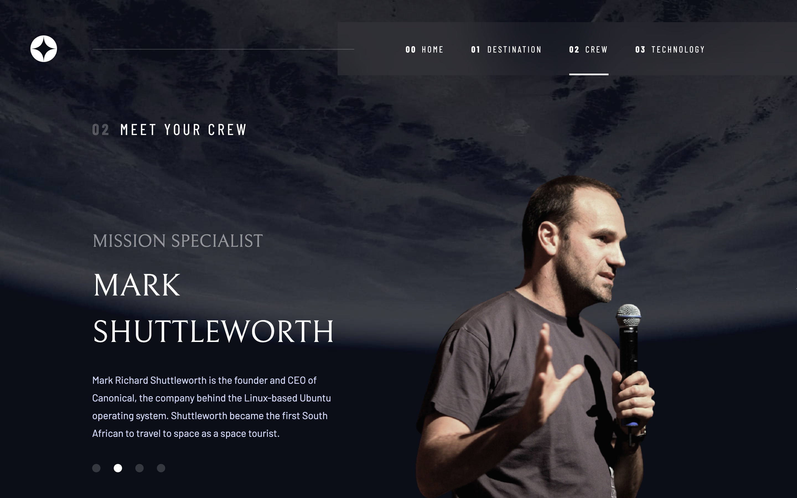
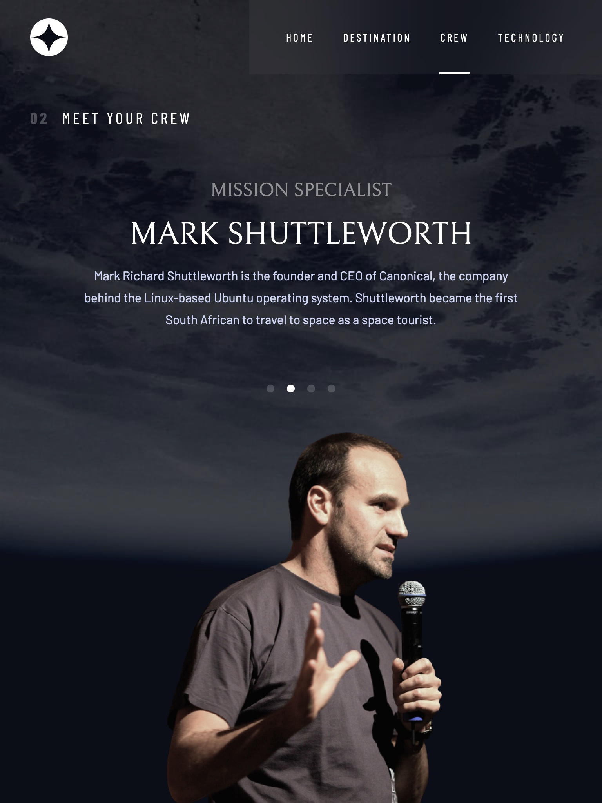

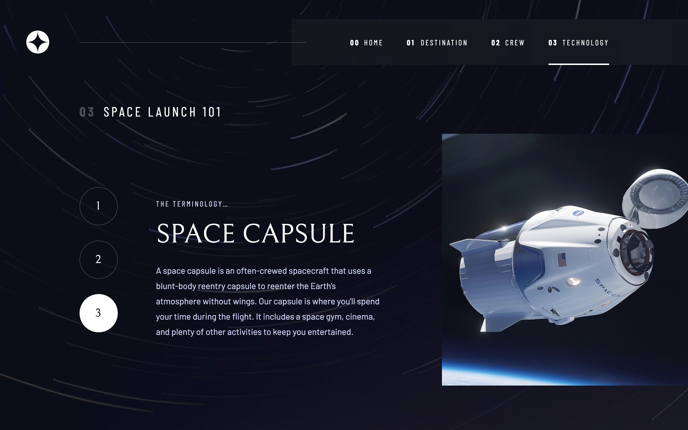
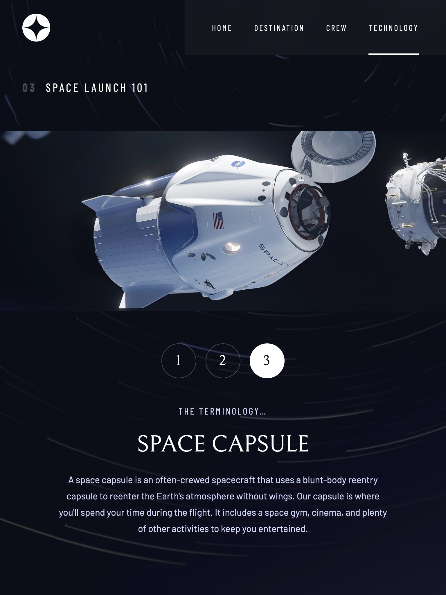
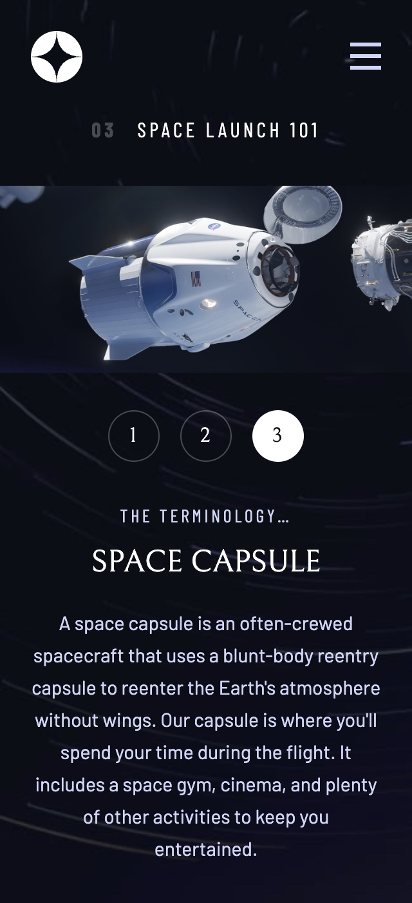

### Links

- Solution URL: [https://github.com/webdevbynight/space-tourism-website](https://github.com/webdevbynight/space-tourism-website)
- Live Site URL: [https://webdevbynight.github.io/space-tourism-website/](https://webdevbynight.github.io/space-tourism-website/)

## My process

### Built with

- Semantic HTML5 markup
- CSS (via SCSS)
  - custom properties
  - pseudo-classes
  - pseudo-elements
  - flexbox
  - grid layout
- Vanilla JavaScript
- JSON-LD
- Mobile-first workflow

### What I learned

When using `picture`/`source` elements to serve responsive images and declaring the `width` and `height` attributes within the `source` element and the `media` attribute with media queries in ems, Safari may not apply the appropriate image source. With the following code:
```html
<picture>
  <source
    srcset="images/douglas-hurley-desktop@4x.webp 4x,
      images/douglas-hurley-desktop@3x.webp 3x,
      images/douglas-hurley-desktop@2x.webp 2x,
      images/douglas-hurley-desktop.webp 1x"
    width="569"
    height="702"
    media="(min-width: 62.3125em)"
  >
  <source
    srcset="images/douglas-hurley-tablet@4x.webp 4x,
      images/douglas-hurley-tablet@3x.webp 3x,
      images/douglas-hurley-tablet@2x.webp 2x,
      images/douglas-hurley-tablet.webp 1x"
    width="458"
    height="532"
    media="(min-width: 37.5em)"
  >
  
</picture>
```
Safari displays the `douglas-hurley-mobile*.webp` image on a 320px screen, but displays the `douglas-hurley-tablet*.webp` image on a 375px screen, both on macOS and iOS (tested with Safari 16.5). To fix such a problem, the solution I have found is to declare media queries in pixels, like this:
```html
<picture>
  <source
    srcset="images/douglas-hurley-desktop@4x.webp 4x,
      images/douglas-hurley-desktop@3x.webp 3x,
      images/douglas-hurley-desktop@2x.webp 2x,
      images/douglas-hurley-desktop.webp 1x"
    width="569"
    height="702"
    media="(min-width: 997px)"
  >
  <source
    srcset="images/douglas-hurley-tablet@4x.webp 4x,
      images/douglas-hurley-tablet@3x.webp 3x,
      images/douglas-hurley-tablet@2x.webp 2x,
      images/douglas-hurley-tablet.webp 1x"
    width="458"
    height="532"
    media="(min-width: 600px)"
  >
  
</picture>
```

### Continued development

In future projects, I want to focus on exercices allowing me to carry out several page templates in order to get more comfortable in making complete templates, and even complete websites in terms of front-end development, to focus on exercices based on Figma wireframes and to focus on the best ways to refactor SCSS code, more specifically in situations where there are variations on a same component.

### Useful resources

- [WebP Exporter](https://www.figma.com/community/plugin/1181873200384736932/WebP-Exporter) - This plugin for Figma helped me to export images as WebP and be able to do it setting several sizes of my choice for responsive purposes.

## Author

- Website - [Victor Brito](https://victor-brito.dev)
- Frontend Mentor - [@webdevbynight](https://www.frontendmentor.io/profile/webdevbynight)
- Mastodon - [@webdevbynight](https://mastodon.social/@webdevbynight)
